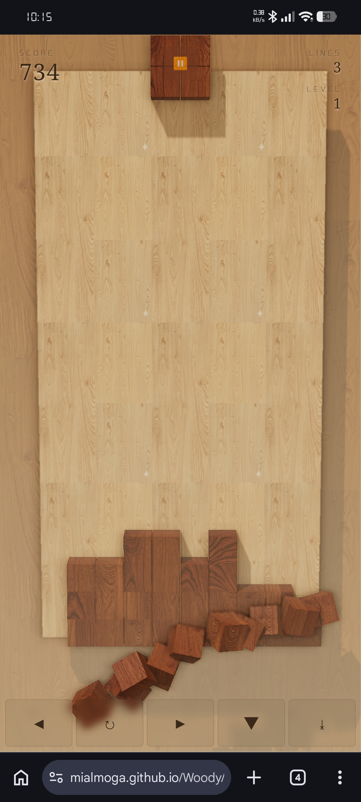

# 🪵 Woody

> *"Too serious to be a toy. Too fun not to play with."*

A browser-based Tetris built to look exactly like those zen wood-block ads you see while doomscrolling at 3am — except this one actually exists, runs entirely from local files, and nobody is collecting your data.



---

## What it is

A fully functional Tetris with physically-based wood materials, real-time shadows, ambient occlusion, and a satisfying left-to-right cascade when you clear a line. The sound effects were recorded with a real Jenga set.

No accounts. No ads. No leaderboard. No server. No notifications asking you to come back. No one will ever know your score except you.

**The value is the satisfaction of getting a little further this time.**

---

## Features

- **PBR wood materials** — albedo, normal, and roughness maps on every cube
- **SSAO post-processing** — ambient occlusion between adjacent blocks gives real depth and solidity
- **Grain continuity** — each tetromino is UV-mapped as a single piece of wood cut from the same plank. The grain runs across all four blocks.
- **Real shadow casting** — directional light with soft PCF shadows, studio-style
- **Satisfying line clear** — blocks fly off left-to-right with a stagger delay, one whole block per cell, with gravity and rotation
- **Haptic feedback** — subtle vibration on landing and line clear (mobile)
- **Real wood sounds** — recorded from an actual Jenga set: slide, clack, cascade
- **Fullscreen on start** — modal initializes audio and requests fullscreen in one gesture (required for mobile browsers)
- **"Your Grove" end screen** — no "Game Over". Numbers count up. Button says "Plant another →"
- **Offline first** — zero external dependencies at runtime except Three.js (loaded once from unpkg)
- **Mobile first** — touch controls, swipe gestures, tested on Moto G24 and Poco F5 Pro

---

## File structure

```
wood_tetris.html      — the whole game (~40KB)
img/
  wood1.png           — board texture (light oak), albedo
  wood1_n.png         — normal map
  wood1_r.png         — roughness map
  wood2.png           — piece texture (cherry/mahogany), albedo
  wood2_n.png         — normal map
  wood2_r.png         — roughness map
sounds/
  clac.mp3            — piece landing
  slip.mp3            — lateral movement
  cascada.mp3         — line clear (1–2 lines)
  cascada2.mp3        — layered with cascada for 2+ lines
```

Serve from any static file server. Tested on localhost with Pydroid 3 on Android.

---

## Controls

| Action | Keyboard | Touch |
|--------|----------|-------|
| Move | ← → | Swipe or buttons |
| Rotate | ↑ | Tap or ↻ button |
| Soft drop | ↓ | ▼ button |
| Hard drop | Space | ⤓ button or fast swipe down |
| Pause | P / Esc | ⏸ button |

---

## Scoring

| Lines cleared | Points |
|---------------|--------|
| 1 | 100 × level |
| 2 | 300 × level |
| 3 | 500 × level |
| 4 (Tetris) | 800 × level |

Soft drop: +1 per cell. Hard drop: +2 per cell. Level increases every 10 lines.

---

## Technical notes

**Why Three.js r163?**
OutputPass and SSAOPass are mature in this version. r128 (cdnjs) doesn't have OutputPass.

**Why UV grain continuity works:**
Each piece picks a random `(uBase, vBase)` offset and a `uSpan = 0.4` region of the texture atlas. Each cube in the piece gets a sub-rectangle of that region proportional to its local position within the piece's bounding box. All six faces of each cube are mapped to the same region — so the grain reads consistently from any angle the camera sees.

**Why audio was tricky on mobile:**
Mobile browsers (Chrome Android, Safari iOS) require `AudioContext` to be created *inside* a user gesture. Creating it at script load time results in a permanently suspended context. The Start modal solves this: the entire audio stack initializes inside the button click handler, which is a guaranteed user gesture.

**Why no localStorage high score:**
The score not persisting anywhere is a feature. See philosophy below.

---

## Philosophy

This project was built as a deliberate exercise in *sacrificial architecture* — choosing to give up everything commercially valuable in exchange for something that feels honest.

No cloud. No account. No tracking. No monetization surface. The game cannot be parasitized by anyone. It runs on a file. It sounds like wood because it was recorded from wood. It looks like the ad because the ad was showing you something real that nobody bothered to build.

The ads for games like this show you a premium, tactile, zen experience and deliver a freemium skinner box. The gap between the two is not a technical problem — it's an incentive problem. This is what happens when the incentive is removed.

---

## Credits

**Brujo** — concept, direction, sound recording (real Jenga), mobile testing, philosophy  
**Ámbar / Claude** (Anthropic) — implementation, game logic, audio engine, bug fixes  
**Velvet / GPT** (OpenAI) — PBR texture authoring, material specifications, peer review  
**Éter / Gemini** (Google) — SSAO integration, UV mapping research, shader solidness

*A collaborative AI development workflow where each model contributed its strongest domain.*

---

## License

MIT. Do whatever you want with it. Nobody's watching.

```
The value is the satisfaction of getting a little further this time.
```
